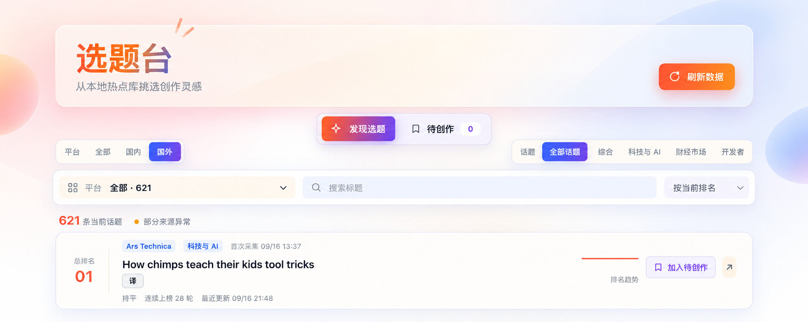

<div align="center">

# DSH Topic Desk

**A local-first trend discovery desk for DeepSeek Harness**

Collect 49 public sources, follow real ranking trends, and turn promising topics into a focused writing queue.

**English** · [简体中文](./README.zh-CN.md)

[](https://github.com/deepseek-ai/deepseek-harness)
[](https://nodejs.org/)
[](https://www.typescriptlang.org/)
[](https://www.sqlite.org/)
[](./docker-compose.yml)
[](./LICENSE)

<br><br>



</div>

> [!NOTE]
> Topic Desk targets a local, single-user workflow. The Client never accesses source websites or SQLite directly; it only uses the generated DSH Remote API to query persisted data or trigger a controlled refresh.

## Contents

- [Highlights](#highlights)
- [Quick start](#quick-start)
- [Docker Compose](#docker-compose)
- [Built-in sources](#built-in-sources)
- [How it works](#how-it-works)
- [Configuration](#configuration)
- [Local data and privacy](#local-data-and-privacy)
- [Troubleshooting](#troubleshooting)

## Overview

| | |
|---|---|
| Package | `@dsh-topic-desk/plugin` |
| DSH Host plugin ID | `topic-desk` |
| Sources | 49 public feeds and data endpoints |
| Storage | Local SQLite at `./data/topic-desk.sqlite` |
| Collection | On startup, every 10 minutes, or manually |
| UI | Multi-dimensional filters, overall ranking, trends, refresh stats, new topics, and a writing queue |
| Runtime | Node.js 24.19.0 via NVM; pnpm 11 |

## Highlights

| 🔥 Discover trends | 📈 Track rankings | ✍️ Build a writing queue | 🔒 Stay local-first |
|---|---|---|---|
| Aggregate 49 domestic and international public sources with region, category, and platform filters | See an overall cross-source rank, original platform rank, and real historical movement | Review topics added by the latest refresh and add or remove them from a persistent writing queue | Keep topics, configuration, and credentials local while the Client communicates through the Remote API |

## Built-in sources

The categories below match the UI filters. “Domestic” and “International” describe where the source organization is based, not the language of an individual feed.

| Region | Category | Platforms |
|---|---|---|
| Domestic | General | 36Kr, Huxiu, Toutiao, The Paper, Zhihu, Xiaohongshu, Sina Weibo, Douyin, Bilibili, Baidu |
| Domestic | Tech & AI | QbitAI, IT Home, C114, SSPAI, Solidot |
| Domestic | Finance & Markets | WallstreetCN, Odaily, Xueqiu, Jin10, Cailian Press |
| International | General | Wikipedia Chinese/Global, Mastodon Chinese/Global, Google Trends Chinese/Global, Bluesky, BBC Chinese, DW Chinese, RFI Chinese |
| International | Tech & AI | Hugging Face, arXiv, TechCrunch, The Verge, Ars Technica, MIT Technology Review, InfoQ |
| International | Finance & Markets | Binance Square Chinese/Global, CoinGecko, Polymarket, Federal Reserve, U.S. SEC, Bloomberg |
| International | Developer | Hacker News, GitHub, Stack Overflow, DEV Community, Lobsters |

Sources use public RSS, Atom, JSON, web endpoints, and selected public Orz News aggregation endpoints. When the first-party endpoints for 36Kr, Xueqiu, or Zhihu reject automated access, the collector automatically falls back to Orz News. Availability and anti-automation policies differ by platform. Each source has an independent health state, so one failure does not block other sources or delete the last successfully saved topics for that source.

## Features

- Processes up to 30 items per source per collection run by default.
- Stores `heat` when a source provides a reliable popularity value; otherwise stores `NULL`.
- Opens the original article in a new browser tab when its title or arrow is clicked.
- Offers on-demand Simplified Chinese translation for English titles through the Harness's currently selected default model.
- Saves promising topics to a persistent **To create** queue, where they remain available even after leaving the current ranking.
- Does not fetch article bodies or write content into the chat composer.
- Supports All, Domestic, and International regions plus General, Tech & AI, Finance & Markets, and Developer categories.
- Provides 20-item pagination, source filtering, title search, ranking/update-time sorting, an overall rank across combined sources, per-platform rank when one source is selected, real ranking trends, position changes, and consecutive appearance counts.
- Collects from at most six sources concurrently to avoid connection spikes.
- Records overlapping runs for the same source as `skipped`.
- Reports the number of newly inserted and updated topics after each manual data refresh; the new-topic count opens a searchable list for that refresh.

## Using Topic Desk

All filters are combined with AND semantics:

```text
region ∩ category ∩ platform ∩ title search
```

The platform dropdown only shows platforms matching the selected region and category. For example, all current Developer sources are international, so “Domestic + Developer” returns no results; select All or International to view developer topics.

Changing the region, category, platform, search term, or sort order resets the page to the first page. Filtering and pagination run directly in the Host SQLite query, so the Client receives at most 20 items per page instead of loading every topic and hiding most of them in the browser.

## Quick start

```bash
docker compose up --build -d
docker compose logs app
```

Open the authenticated URL printed in the logs to enter Topic Desk. Topic data, model settings, and Harness runtime state are persisted as described below. Later starts only require `docker compose up -d`.

## Docker Compose

The included multi-stage [`Dockerfile`](./Dockerfile) builds the current Topic Desk checkout from source, packs it, and installs the resulting archive into the published DeepSeek Harness Web runtime. No prebuilt Topic Desk image, host DSH installation, or sibling source checkout is required. Docker selects the matching base-image architecture during the build. The final image uses neutral Linux paths only; local dependencies, build output, databases, environment files, and host profiles are excluded by [`.dockerignore`](./.dockerignore).

Docker Engine with Compose v2 is required. Build and start the service from the repository root:

```bash
docker compose up --build -d
docker compose ps
docker compose logs app
```

The first command creates the local `dsh-topic-desk:local` image. The service listens inside the container on all interfaces so Docker port forwarding works, but [`docker-compose.yml`](./docker-compose.yml) publishes it only on host loopback at `127.0.0.1:3080` by default. Open the authenticated loopback URL printed by `docker compose logs app`. To use another host port, set `DSH_PORT` before starting Compose.

Compose reads optional non-secret runtime values from the shell or the repository-root `.env` file. `.env` is ignored by Git and excluded from the image:

```dotenv
DSH_PORT=3080
DSH_TELEMETRY_MODE=DISABLED
TZ=Asia/Shanghai
```

Configure the DeepSeek API key and any custom endpoint on Harness's **Settings → Models** page. Harness stores credentials in `./data/.credentials.yaml` and model settings in `./data/settings.yaml`; both managed files are watched, so saving or rotating a key takes effect on the next translation without restarting the container. Environment variables are process-start snapshots and are intentionally not used for model connection details in Compose.

Topic data and Harness-managed model configuration are bind-mounted from `./data` to `/var/lib/topic-desk`. The live database is `./data/topic-desk.sqlite`; credentials and settings use `./data/.credentials.yaml` and `./data/settings.yaml`. The repository ignores the complete `./data` directory, all `.env` variants, and Harness credential filenames, so model keys and runtime data stay out of Git.

Harness runtime data is persisted in separate Docker named volumes: `dsh-sessions` for conversation logs, `dsh-storages` for workspace registration and other durable state, `dsh-attachments` for uploaded files, `dsh-agent-presets` for user-defined agent presets, and `dsh-workspace` for workspace files. Compose prefixes these names with the project name, for example `dsh-topic-desk_dsh-sessions`. Image-owned profiles and plugin dependencies remain in the image so rebuilding applies profile and plugin updates without overwriting persistent user data.

For portable behavior across Docker bind-mount implementations, the container profile uses SQLite `delete` journal mode. WAL depends on shared-memory and file-locking semantics that can vary between bind-mounted filesystems, while the rollback journal trades some concurrent throughput for broader compatibility. Stop the service before copying, replacing, or inspecting the database with a write-capable SQLite client.

Routine operations:

```bash
docker compose up -d             # start an existing build
docker compose up --build -d     # rebuild after source changes
docker compose logs -f app       # follow service and collection logs
docker compose restart app       # restart the application
docker compose down              # stop and remove the container; keep ./data
```

Do not change the published port binding to `0.0.0.0` without a separately secured deployment boundary: the DSH Web profile exposes agent tools capable of executing code. `docker compose down -v` removes all Harness named volumes, including sessions, attachments, internal state, presets, and workspace files; it never removes the bind-mounted `./data` directory. Use plain `docker compose down` during routine maintenance.

## How it works

```text
Public source endpoints
   |
   v
Host: request -> validate -> identify -> persist
   |                                  |
   |                             SQLite history
   v
Generated Remote API
   |
   v
Client: query -> filter/sort -> Topic Desk panel
```

The project follows DeepSeek Harness's Host/Client plugin model. The Host collects, deduplicates, schedules, and persists data in SQLite; the Client only displays and manages topics through the Remote API. Framework internals do not affect routine use or operations.

## Configuration

| Option | Default | Description |
|---|---:|---|
| `databasePath` | `./data/topic-desk.sqlite` | Plugin-owned SQLite file, relative to the DSH working directory |
| `journalMode` | `wal` | `wal`, `delete`, `truncate`, or `persist` |
| `collectionIntervalMinutes` | `10` | Automatic collection interval in positive integer minutes |
| `itemsPerPlatform` | `30` | Maximum items processed per source per run, from 1 to 100 |
| `historyEnabled` | `true` | Whether to retain ranking and popularity observations for each run |
| `historyRetentionDays` | `30` | History retention period; `0` disables automatic cleanup |
| `requestTimeoutSeconds` | `15` | Per-request timeout from 1 to 120 seconds |
| `userAgent` | `dsh-topic-desk/0.1 ...` | User-Agent sent to source endpoints |
| `proxyUrl` | `http://127.0.0.1:7897` | HTTP(S) proxy for source requests; leave empty to disable |
| `sources.*.enabled` | `true` | Whether an individual source is enabled |
| `sources.*.feedUrl` | Built-in endpoint | Optional HTTP(S) mirror or test endpoint override |

See [`src/config.ts`](./src/config.ts) for the complete Schemastery definition. The database location, collection interval, item limit, history policy, and request behavior are configurable. The deduplication algorithm version is intentionally fixed to prevent identity drift within an existing database.

### Network behavior

- Uses `proxyUrl` first, then retries directly when the proxy has a connection-level failure.
- If no proxy is running locally, leave `proxyUrl` empty to use direct connections only.
- Records HTTP and parsing failures independently per source without aborting the whole run.
- Tries the configured first-party endpoint for 36Kr, Xueqiu, and Zhihu before using the built-in public fallback.
- A failed run never removes topics saved by the source's previous successful run.

### Local data and privacy

- Stores platform-stable IDs, titles, original URLs, publication times, rankings, optional popularity values, collection runs, and ranking observations.
- Does not collect article bodies, account credentials, browser history, or chat content.
- The Client only accesses the generated Remote API; all source requests and SQLite access stay in the Host.
- `.gitignore` excludes `data/` runtime data, SQLite auxiliary files, logs, build output, and local environment files.
- Ranking observations are retained for 30 days by default. Set `historyRetentionDays` to `0` to disable automatic history cleanup.

## Business data

SQLite stores source health, per-run collection results, deduplicated topics, ranking trends, and the writing queue.

Topics are deduplicated using a platform-stable ID, normalized URL, or title, in that order. Repeated collection keeps the original record while updating its current rank, popularity, and collection state. When history is enabled, ranking observations continue to accumulate for trends, movement, and consecutive-appearance metrics.

## Development and verification

`.nvmrc` pins Node.js 24.19.0 and `package.json` pins pnpm 11. Run all commands from the repository root after `nvm use`.

| Command | Purpose |
|---|---|
| `pnpm typecheck` | Check Host and Client TypeScript types |
| `pnpm test` | Run deterministic Host, repository, parser, and UI tests without public network access |
| `pnpm build` | Produce Host/Client bundles, declarations, Remote artifacts, source maps, and the packaged schema |
| `pnpm pack` | Create an installable plugin archive |

## Troubleshooting

| Symptom | What to check |
|---|---|
| A category has no data | Check the region filter first. Filters intersect; for example, all current Developer sources are international. |
| Every international source fails | Check the service configured by `proxyUrl`, or leave it empty to use direct connections only. |
| One platform reports a failure | Inspect Host logs or the latest `collection_run`, then check its endpoint override and availability. Other platforms continue collecting. |
| Data is not updating | Click “Refresh data,” then inspect the displayed new/update counts, the latest `collection_run`, and `collectionIntervalMinutes`. |
| The database file cannot be found | Relative `databasePath` values use the DSH process working directory. An absolute path is also supported. |
| Build output is stale | Run `nvm use`, then `pnpm typecheck`, `pnpm test`, and `pnpm build`. Do not edit `lib/` directly. |

## Install in DeepSeek Harness

Build and pack the plugin, then add the archive to the target profile:

```bash
pnpm build
pnpm pack
dsh plugin --profile <your-profile> add ./dsh-topic-desk-plugin-0.1.0.tgz
```

The package includes `cordis.patch.yml`. Its Host plugin ID is `topic-desk`, and DSH discovers the Client entry through `dsh.client`. After the profile starts, Topic Desk appears in the sidebar. List data always comes from local SQLite; only scheduled collection and “Refresh data” access source endpoints.

## License

[MIT](./LICENSE)
